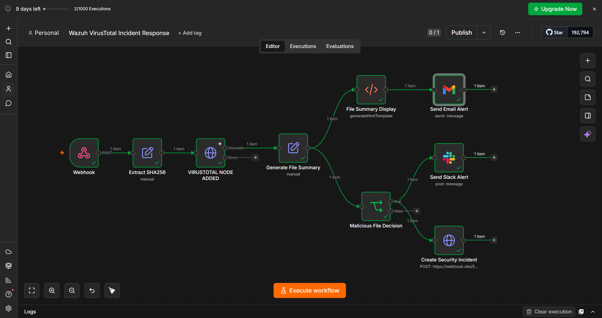
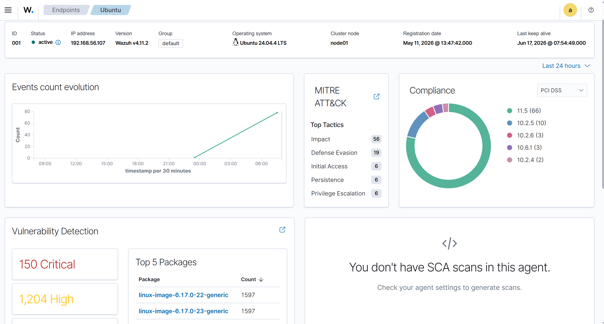
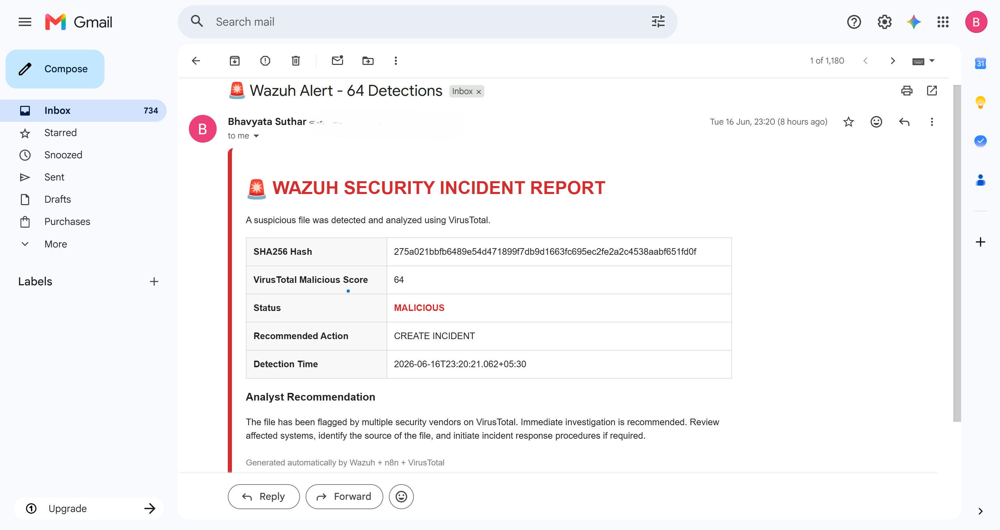

# Wazuh + VirusTotal Automated Incident Response

## Project Overview

This project demonstrates an automated Security Operations Center (SOC) incident response workflow built using Wazuh, VirusTotal, and n8n.

The workflow automatically detects file integrity events from Wazuh, performs reputation analysis through VirusTotal, generates a security summary, and triggers alerting and incident creation actions without manual intervention.

The objective is to reduce analyst workload, accelerate threat triage, and improve response time for potentially malicious files.

---

## Problem Statement

SOC analysts often spend significant time performing repetitive tasks after a security alert is generated:

- Extracting file hashes
- Checking threat intelligence sources
- Determining file reputation
- Creating incident reports
- Sending notifications
- Escalating security events

This project automates these tasks to enable faster and more consistent incident response.

---

## Solution Architecture

```text
Wazuh FIM Alert
        │
        ▼
   n8n Webhook
        │
        ▼
Extract SHA256 Hash
        │
        ▼
VirusTotal Reputation Check
        │
        ▼
Malicious Score Evaluation
        │
 ┌──────┴──────┐
 ▼             ▼
Email Alert   Slack Alert
 │             │
 └──────┬──────┘
        ▼
Incident Creation
```
---

## Workflow Explanation

### 1. File Integrity Monitoring Detection

Wazuh File Integrity Monitoring (FIM) detects a newly created or modified file on a monitored endpoint.

### 2. SHA256 Extraction

The workflow extracts the SHA256 hash from the Wazuh alert payload.

### 3. VirusTotal Reputation Lookup

The extracted hash is sent to the VirusTotal API to determine whether the file has been identified as malicious by security vendors.

### 4. Security Summary Generation

Relevant threat information is collected and converted into a structured incident summary.

### 5. Threat Evaluation

The workflow evaluates the VirusTotal malicious score and determines whether further action is required.

### 6. Alerting

When a malicious file is detected:

- Email notification is generated
- Slack alert is triggered
- Security incident data is prepared

### 7. Incident Creation

Incident details are forwarded to an external incident management endpoint for tracking and investigation.

---

## Key Features

- Automated malware reputation analysis
- VirusTotal API integration
- Wazuh SIEM integration
- Security incident enrichment
- Automated email notifications
- Slack alert generation
- Incident creation workflow
- No manual analyst intervention required

---

## Technologies Used

| Technology | Purpose |
|------------|----------|
| Wazuh | Security Monitoring & FIM |
| VirusTotal | Threat Intelligence |
| n8n | Workflow Automation |
| Gmail | Email Notifications |
| Slack | Team Alerting |
| Webhooks | Incident Integration |
| Ubuntu Linux | Lab Environment |

---

## Screenshots

### n8n Workflow



### Wazuh Dashboard



### Email Alert Generated



---

## Security Benefits

- Faster threat detection
- Reduced analyst workload
- Consistent incident handling
- Automated enrichment using threat intelligence
- Improved Mean Time To Respond (MTTR)
- Better visibility into potentially malicious files

---

## Future Enhancements

- ServiceNow integration
- Jira ticket creation
- Microsoft Teams notifications
- Host isolation using Wazuh Active Response
- Threat intelligence enrichment from multiple feeds
- Automated SOAR playbooks

---

## Repository Contents

```text
.
├── Wazuh VirusTotal Incident Response.json
├── README.md
├── LICENSE
└── screenshots/
    ├── workflow.png
    ├── wazuh-dashboard.png
    └── email-alert.png
```

---

## Author

**Bhavyata Suthar**

Cybersecurity Enthusiast | SOC Analyst | SIEM | Incident Response | Threat Detection
